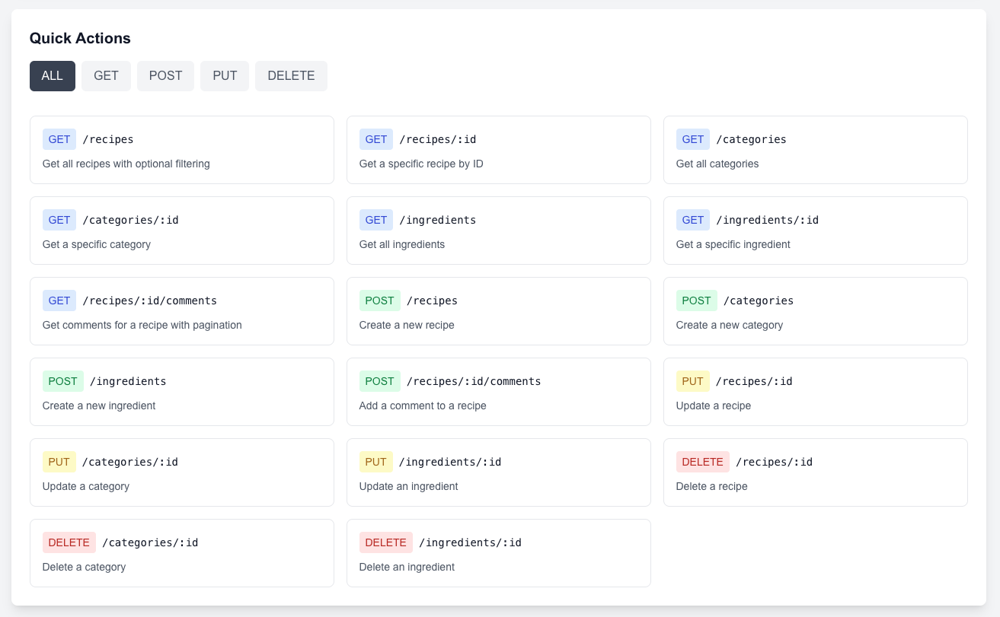
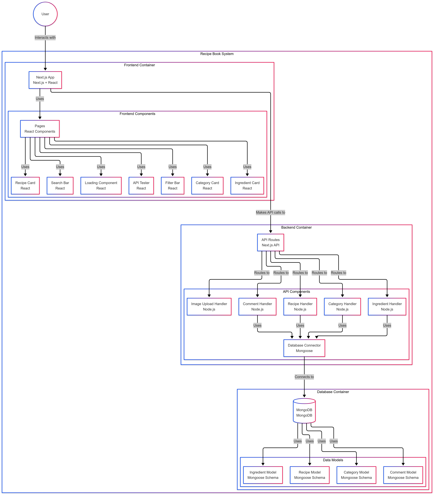

# 🍳 Recipe Book API

<div align="center">


A modern, full-stack recipe management application with a RESTful API, built with Next.js, MongoDB, and TypeScript.

[Getting Started](#getting-started) •
[Docker Setup](#docker-setup) •
[API Documentation](#api-documentation) •
[Architecture](#architecture)

</div>

## ✨ Features

- 📝 Complete CRUD operations for recipes
- 🏷️ Category management
- 🥕 Ingredient tracking
- 💬 Recipe comments and ratings
- 📸 Image upload support
- 🔍 Advanced search and filtering
- 📱 Responsive design
- 🚀 API documentation interface

## 🚀 Getting Started

### Prerequisites

- Node.js 20+
- MongoDB
- npm/yarn/pnpm/bun

### Local Development Setup

1. Clone the repository:

```bash
git clone https://github.com/yourusername/recipeBook.git
cd recipeBook
```

2. Install dependencies:

```bash
npm install
```

3. Create a `.env` file in the root directory:

```bash
MONGODB_URI=mongodb://localhost:27017/recipe-book
```

4. Start the development server:

```bash
npm run dev
```

The application will be available at [http://localhost:3005](http://localhost:3005)

## 🐳 Docker Setup

### Using Docker Compose

1. Start the complete stack:

```bash
docker-compose up
```

This will:
- Start MongoDB container
- Build and start the application
- Run database seeding
- Make the app available at [http://localhost:3005](http://localhost:3005)

### Individual Container Setup

1. Start MongoDB:

```bash
docker-compose up mongo
```

2. Build and run the application:

```bash
docker build -t recipe-book .
docker run -p 3005:3005 recipe-book
```


## 📚 API Documentation

I build an own Interactive API documentation, it is available at [http://localhost:3005/api-docs](http://localhost:3005/api-docs) when the application is running. The documentation includes:

- Real-time API testing interface
- Request/response examples
- Parameter descriptions
- Authentication requirements

### API Endpoints Overview

- **Recipes**: `/api/recipes`
  - GET, POST, PUT, DELETE operations
  - Image upload support
  - Search and filtering capabilities

- **Categories**: `/api/categories`
  - Complete CRUD operations
  - Validation and error handling

- **Ingredients**: `/api/ingredients`
  - Ingredient management
  - Unit conversion support

- **Comments**: `/api/recipes/:id/comments`
  - Comment creation and retrieval
  - Pagination support

### API Documentation Interface



## 🏗️ Architecture

### Architecture Diagram



### Project Structure

```bash
recipe-book/
├── src/
│ ├── app/ # Next.js 13+ App Router
│ │ ├── api/ # API Routes
│ │ └── api-docs/ # API Documentation UI
│ ├── components/ # React Components
│ ├── lib/ # Utilities and Configurations
│ ├── models/ # MongoDB Schemas
│ └── types/ # TypeScript Type Definitions
├── public/ # Static Assets
└── docker/ # Docker Configuration
```

### Technology Stack

- **Frontend**: Next.js 15.1.6, React 19
- **Backend**: Next.js API Routes
- **Database**: MongoDB 6.13.0
- **ORM**: Mongoose 8.10.0
- **Styling**: Tailwind CSS
- **Type Safety**: TypeScript
- **Development**: Docker, ESLint
- **API Documentation**: Custom built interactive documentation

### Key Design Patterns

1. **Model-View-Controller (MVC)**
   - Clear separation of data models and API routes
   - Centralized error handling
   - Type-safe data transfer

2. **Repository Pattern**
   - Abstracted database operations
   - Reusable data access layer

3. **Middleware Pattern**
   - Database connection management
   - Request validation
   - Error handling

## 🤝 Contributing

1. Fork the repository
2. Create your feature branch (`git checkout -b feature/amazing-feature`)
3. Commit your changes (`git commit -m 'Add some amazing feature'`)
4. Push to the branch (`git push origin feature/amazing-feature`)
5. Open a Pull Request


## 🙏 Acknowledgments

- Next.js team for the amazing framework
- MongoDB team for the robust database

---

<div align="center">

Made with ❤️ by [@Sangeeths11](https://github.com/Sangeeths11)

</div>
